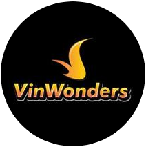

<h1 align="center">Hulk Angular Core</h1>

  
   
  <i>Development platform for Angular projects</i>
   

  <a href="https://www.angular.io"><strong>www.angular.io</strong></a>
   

&nbsp;
    &nbsp;
  &nbsp;
  &nbsp;

## Peer Dependencies For UI Control

- [Quill (1.3.7) & Ngx Quill (14.0.0)](https://www.npmjs.com/package/ngx-quill)
- [Ng Zorro (11.4.1)](https://ng.ant.design/docs/introduce/en)

## Documentation

- [Getting Started](https://github.com/CloudHMS/hulk.portal.aps/blob/master/docs/developer/00-getting-started.md)
- [Git Rules](https://github.com/CloudHMS/hulk.portal.aps/blob/master/docs/developer/01-git.md)
- [The Art Of Naming](https://github.com/CloudHMS/hulk.portal.aps/blob/master/docs/developer/02-the-art-of-naming.md)
- [Rxjs](https://github.com/CloudHMS/hulk.portal.aps/blob/master/docs/developer/06-rxjs.md)
- [State Management](https://github.com/CloudHMS/hulk.portal.aps/blob/master/docs/developer/06-state-management.md)

### Advanced

- [Nx Workspace](https://github.com/CloudHMS/hulk.portal.aps/blob/master/docs/architecture/01-nx-workspace.md)

## Core Team

<table>
  <tr>
    <td align="center"><a href="https://github.com/phong3091998"> <b>Phong Cao - Drake</b></a> </td>
    <td align="center"><a href="https://github.com/LucNguyen17291"> <b>Lục Nguyễn - Lucas</b></a> </td>
    <td align="center"><a href="https://github.com/ngongocthien96"> <b>Thiện Ngô</b></a> </td>
    </tr>
</table>

## Contributors ✨

Thanks goes to these wonderful people ([emoji key](https://allcontributors.org/docs/en/emoji-key)):
